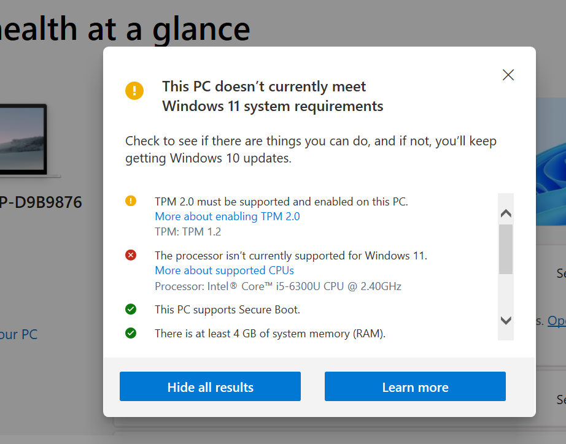
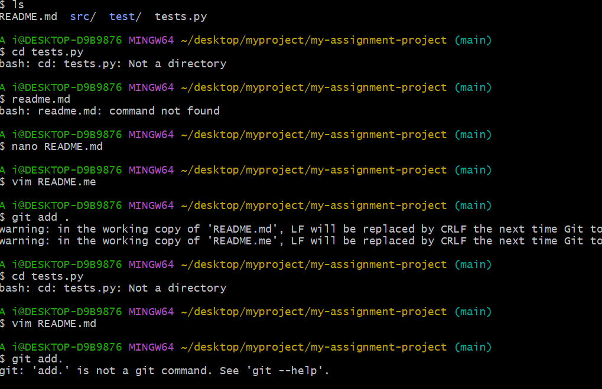
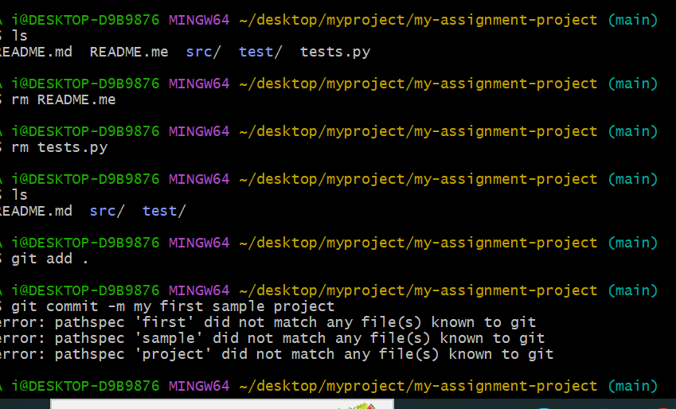

# Dev_Setup
Setup Development Environment

#Assignment: Setting Up Your Developer Environment

#Objective:
This assignment aims to familiarize you with the tools and configurations necessary to set up an efficient developer environment for software engineering projects. Completing this assignment will give you the skills required to set up a robust and productive workspace conducive to coding, debugging, version control, and collaboration.

#Tasks:

1. Select Your Operating System (OS):
   Choose an operating system that best suits your preferences and project requirements. Download and Install Windows 11. https://www.microsoft.com/software-download/windows11
My operating system is Windows 10. I could not manage to download and install windows 11 because my processor does not support windows 11

2. Install a Text Editor or Integrated Development Environment (IDE):
   Select and install a text editor or IDE suitable for your programming languages and workflow. Download and Install Visual Studio Code. https://code.visualstudio.com/Download
   Open chrome web browser and go to https://code.visualstudio.com/Download
   I located the downloaded file in 'downloads' with the name 'VSCodeUserSetup-*64-<version>.exe and double clicked it to run it
   clicked yes on promped that appeared asking to allow VScod to make changes and clicked next. Accept th licence agreement and click next.
   choose where you want the VS code to be installed and click next. select the additional tasks and click next. Then click install and launch your VS code

3. Set Up Version Control System:
   Install Git and configure it on your local machine. Create a GitHub account for hosting your repositories. Initialize a Git repository for your project and make your first commit. https://github.com
   click on the above link and download Git
   Find the folder named 'Git-<version>-64-bit.exe' in the downloads annd double click it to run it
   click yes on the prompt that appears to allow Git to make changes in your device
   click next on the default selected components
   choose option 'Git from the command line and also from third party software' and click next
   choose a preffered text editor and click next
   choose the dfault option by clicking next until you click finish which allows installation of Git
   go to GitHub website and sign up
   choose a username and enter yoyr email address
   create a password and verify your email address
   Open Git Bash from start up menu and use the command cd/path/to your project
   use th command git init to initiate a new Git rpository
   use the command git status to see the status of the project
   use command git add . to add files for tracking or use the command git add filename
   then use the command git commit -m "intial commit"
   confirm that it was a successful commit by using the command git log

4. Install Necessary Programming Languages and Runtimes:
  Instal Python from http://wwww.python.org programming language required for your project and install their respective compilers, interpreters, or runtimes. Ensure you have the necessary tools to build and execute your code.
  click on th above link and download the latest version of python which is python version 3.12.3
  locate the downloaded python file from downloads and double click it to run it
  check the box that says "add python 3.12 to PATH"
  click on customize installation and review optional features such as documation, pip, tcl/tk and IDLE, Python test suite, py launcher and then click next
  click on install and after installation, click on close
  to confirm that you have install, open git bash or command prompt and use the command python --version

5. Install Package Managers:
   If applicable, install package managers like pip (Python).
open your browser and go to https://bootstrap.pypa.io/get-pip.py and save the file
go to command prompt and navigate wher you savd get-pip.py
run the command python get-pip-py
6. Configure a Database (MySQL):
   Download and install MySQL database. https://dev.mysql.com/downloads/windows/installer/5.7.html
   click on the above link and download MySQL
   open th downloads folder and find the downloaded MySQL file and double click it to run it
   you will then be prompted to choose set up
   select that best suits your needs
   click on xcute to install it
choos the development machine as your configuration type
set the connectivity options
set a strong root password and confirm it
configure MySQL server as window service
click execute to configure settings
click on finish to exit the installer

7. Set Up Development Environments and Virtualization (Optional):
   Consider using virtualization tools like Docker or virtual machines to isolate project dependencies and ensure consistent environments across different machines.

8. Explore Extensions and Plugins:
open  Vs code on the computer and open extensions by clicking on Extensions icon on the left hand side of your VS Code screen
use search bar to find specific extensions such as Dart, code runner and python
click on install button to  add an extension of your choice

    

9. Document Your Setup:
    Create a comprehensive document outlining the steps you've taken to set up your developer environment. Include any configurations, customizations, or troubleshooting steps encountered during the process. 
    Setting up my developer environment has involved downloading and installing VS Code, Git bash and python.

#Deliverables:
- Document detailing the setup process with step-by-step instructions and screenshots where necessary.
- A GitHub repository containing a sample project initialized with Git and any necessary configuration files (e.g., .gitignore). 
the link to the project crated is this https://github.com/Baswata/my-assignment-project.git
- A reflection on the challenges faced during setup and strategies employed to overcome them. 
the challenge I faced was the fact that I opened the RADME file using nano which made me unable to git add.
I decided to open again using Vim and later deleated the READme file that I had opened with nano by using the command rm README.me

#Submission:
Submit your document and GitHub repository link through the designated platform or email to the instructor by the specified deadline.

#Evaluation Criteria:**
- Completeness and accuracy of setup documentation.
- Effectiveness of version control implementation.
- Appropriateness of tools selected for the project requirements.
- Clarity of reflection on challenges and solutions encountered.
- Adherence to submission guidelines and deadlines.

Note: Feel free to reach out for clarification or assistance with any aspect of the assignment.
